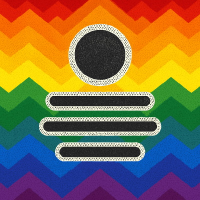

  <!-- Place the provided logo image at docs/assets/logo.png -->
  
   
  <em>Brettspielrunde — the shared digital memory and organizer for your board game nights</em>

Summary
-------
Brettspielrunde is the shared digital home for a gaming group — a place to record sessions, remember highlights, and plan future game nights. This repository contains the official app content that embodies the Brettspielrunde: data models, session logic and the user-facing content used by the mobile, desktop and other clients.

What the app does
-----------------
The app helps groups answer simple questions about their shared game nights:
- What did we play and when?
- Who attended and how did they score?
- Which games are favorites, and which should we try next?
- What funny stories or house-rules did we create?

Core goals
----------
- Capture session history with players, games, results and notes.
- Keep a simple game collection for the group: what you own, want to play, or recommend.
- Provide quick tools for adding sessions during or after a night.
- Offer an exploratory view (timeline, most played, activity) to celebrate your group's history.

Key features
------------
- Session log: date, location, players, games, results and freeform notes.
- Player management: simple profiles, nicknames and session links.
- Game library: player counts, durations, tags and “want to play” flags.
- Notes & highlights: store memorable moments and house rules with sessions.
- Group overview: timeline and lightweight statistics to understand the group's habits.
- Desktop client available for comfortable browsing and editing.

Platforms
---------
Brettspielrunde is intended to be available across devices so your group's data is wherever you need it:
- Mobile: quick entry at the table
- Desktop: comfortable browsing and editing
- Web (optional): access without installation
The exact platform set may evolve, but the data and experience should follow the group.

Who is this for?
----------------
- Regular gaming groups
- Casual meetups with changing players
- Clubs or cafés that want a simple play log
- Anyone who wants a “game night diary” rather than a competitive tracker

Project status & access
-----------------------
- This repository is private. Request access from the organization maintainers to view or contribute.
- The product is in active development — features may change rapidly.

How to get access
-----------------
- Ask the repo maintainers / organization owners for read or write access.
- After access is granted, clone the repo using SSH or HTTPS and follow the build/run instructions in the repository.

Vision
------
Brettspielrunde should be the natural memory of your group: easy to add entries during the evening, useful to look back on later, and helpful when planning the next game night.

Contact
-------
If you are part of the organization and want access, want to contribute, or want to discuss the concept, contact the maintainers through your organization's internal communication channels.

Thank you
